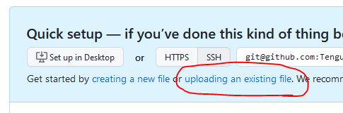
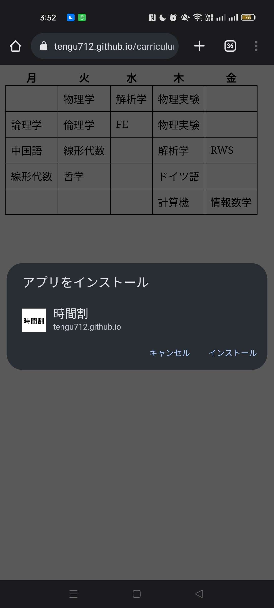

<!-- _class: top -->
# 時間割スマホアプリを作る

## RICORA Programming Team, 4IS 天狗

---

<!-- _class: section -->
# はじめに

---

<!-- _class: normal -->
# 触れること

* HTML+CSS
* JavaScript
* GitHub (pages)
* PWA

---

<!-- _class: normal -->
# 最低限のリテラシー

**以下すべてを満たさない人が過半数であった場合、別のワークショップを行います。**

* ディレクトリとファイルの概念を知っている
* 適当なディレクトリに空のテキストファイルを作れる
* 既存の知識から新概念を推察する癖がある
* ggるとか誰かに訊くとかする癖がある

---

<!-- _class: normal -->
# 対象外の人

* 「どんな技術を使ってもいいのでスマホ向けの時間割アプリを作ってください」
  と言われて手順が一瞬で思い浮かぶ人
* 先の「触れること」がすべて分かる人
* よっぽどウェブに興味のない人
* もっと難しいことをしたい人

---

<!-- _class: normal -->
# マインドセット

**とにかく色々なものに触れてみよう**というワークショップです。
**勉強会ではない**ので、個々に対して**深掘りしません**。

馬鹿馬鹿しいほど初歩的な内容なので、身構えないでください。
むしろ、**何こんな簡単なこと教えて良い気になってんだ馬鹿が**、とぼくを馬鹿にする気概でいてください。

---

<!-- _class: normal -->
# メソッド

* スマホアプリを作る
  * Android SDKとかFlutterとか
  * APIやフレームワークを扱う→大袈裟
* ウェブページとして作る
  * PWAでスマホアプリっぽくできる
  * フレームワークなしでOK

ここでは二番目を採用する。

---

<!-- _class: normal -->
# 手順

1. ウェブページを作る
2. ネットワークにデプロイする
3. スマホにインストールする

---

<!-- _class: section -->
# ウェブページを作る

---

<!-- _class: normal -->
# そもそもウェブページは

**どこかにある**HTMLや付随する**データ**をダウンロードしてきて、**ウェブブラウザが処理**する。


---

<!-- _class: normal -->
# HTMLとは

**構造を記述するためのデータ形式。**
特にウェブブラウザで主力。

**タグ**で囲むことで意味付けと構造化を行う。
`<タグ名>`で始まり、`</タグ名>`で終わる(例外あり)。

```html
<foo>この中にfooの内容を書く</foo>

<bar>
    <baz>
        ここはbarの中のbazの中
    </bar>
    <qux>
        ここはbarの中のquxの中
    </qux>
</foo>
```

---

<!-- _class: normal -->
# 時間割表を作る

index.html

```html
<!DOCTYPE html>
<meta charset="utf-8">
<meta name="viewport"
      content="width=device-width, initial-scale=1, minimum-scale=1, user-scalable=yes">
<title>時間割</title>
<table>
    <tr><th>月</th><th>火</th><th>水</th><th>木</th><th>金</th></tr>
    <tr><td></td><td>物理学</td><td>解析学</td><td>物理実験</td><td></td></tr>
    <tr><td>論理学</td><td>倫理学</td><td>FE</td><td>物理実験</td><td></td></tr>
    <tr><td>中国語</td><td>線形代数</td><td></td><td>解析学</td><td>RWS</td></tr>
    <tr><td>線形代数</td><td>哲学</td><td></td><td>ドイツ語</td><td></td></tr>
    <tr><td></td><td></td><td></td><td>計算機</td><td>情報数学</td></tr>
</table>
```

---

<!-- _class: normal -->
# 結果

表ができた。

見た目がしょぼい。


---

<!-- _class: normal -->
# CSSとは

デザインを記述するデータ形式。
ウェブページのデザインは必ずこの形式を取る。

`ターゲット { 設定1; 設定2; ... }`と記述する。

```css
body {
    background-color: black;
}
td:first-child {
    border-left: none;
    font-weight: bold;
}
```

---

<!-- _class: normal -->
# 装飾する

```html
<!DOCTYPE html>
<meta charset="utf-8">
<meta name="viewport"
      content="width=device-width, initial-scale=1, minimum-scale=1, user-scalable=yes">
<title>時間割</title>
<style>
    table {
        border-collapse: collapse;
    }
    td {
        border: solid 1px black;
        padding: 0.5em;
    }
</style>
<table>
<!-- 以下省略 -->
```

---

<!-- _class: normal -->
# 結果

見た目ができたということにする。

HTMLで表を書くのがだるい。
簡単なデータ形式に分離して、tableに直したい。


---

<!-- _class: normal -->
# JavaScriptとは

スクリプト言語の一つ。
少なくとも主要な**ウェブブラウザは標準的に実行できる**。

**動的にウェブページを操作できる**。
「データ」に対して「プログラム」の部分を記述する手段。

```js
const variable = 3;
function hello() {
    console.log("hello world!");
    console.log(variable + 0.14);
}
```

---

<!-- _class: normal -->
# データを切り分ける

時間割データを簡単なCSV形式に切り分ける。

data.csv

```
月,火,水,木,金
,物理学,解析学,物理実験,
論理学,倫理学,FE,物理実験,
中国語,線形代数,,解析学,RWS
線形代数,哲学,,ドイツ語,
,,,計算機,情報数学
```

---

<!-- _class: normal -->
# JavaScriptで解析・反映する

```html
<!DOCTYPE html>
<!-- 中略 -->
</style>
<script>
    function parse(text) {
        return text.split('\n').map(line => line.split(','));
    }
    function create_table(data) {
        const table = document.createElement('table');
        for (let i = 0; i < data.length; ++i) {
            const tr = document.createElement('tr');
            for (const column of data[i]) {
                const th_or_td = document.createElement(i == 0 ? 'th' : 'td');
                th_or_td.innerText = column;
                tr.appendChild(th_or_td);
            }
            table.appendChild(tr);
        }
        return table;
    }
    fetch('data.csv', { method: 'GET' })
        .then(response => response.text())
        .then(text => document.body.appendChild(create_table(parse(text))));
</script>
```

---

<!-- _class: normal -->
# 結果

**CORS要求がブロックされるので正常に動作しない。**

ウェブブラウザは安全でないリソース共有をブロックする。
今回は、リクエストで指定されたURLがHTTPでないから。

解決するには、ローカルでもいいので**サーバを立てる必要がある**。
OS標準でサーバを立てられないので、今回はスキップ。

サーバにデプロイしたときに正常に動作すると信じることにする。(本来ならダメ)

---

<!-- _class: section -->
# ネットワークにデプロイする

---

<!-- _class: normal -->
# ウェブサイトホスティング

ウェブサイトをウェブサイトとしてダウンロードさせるには、
ウェブサイトホスティングが必要。

ウェブサイト用のレンタルサーバを借りるのが普通？

GitHubやGoogle Driveなどの「ファイル置き場」が提供していることも。
今回はGitHubを使う。

---

<!-- _class: normal -->
# GitHubとは

ファイルのバージョン管理ソフトウェア「Git」のリモートリポジトリホスティングサービス。

**GitHub Pagesという、ウェブサイトホスティングサービスがある。**


---

<!-- _class: normal -->
# デプロイする

1. [https://github.com/](https://github.com/)からGitHubのアカウントを作る
2. [https://github.com/new](https://github.com/new)からリポジトリを作る
3. index.htmlとdata.csvをアップロードする

(この方法ではたしかディレクトリを作れないが、今回は不要なので大丈夫)



---

<!-- _class: normal -->
# デプロイする

4. リポジトリの「Settings」の「Code and automation」の「Pages」を開く
5. 「Build and deployment」の「Branch」からmainブランチを選んで「Save」


---

<!-- _class: normal -->
# 確認する

https://ユーザー名.github.io/リポジトリ名/ にアクセスする。

スマホからでも見られる。


---

<!-- _class: section -->
# スマホにインストールする

---

<!-- _class: normal -->
# PWAとは

Webサイトをネイティブアプリのようにインストールする技術。

ネイティブアプリとしてビルド/リリースしなくても、各種対応プラットフォームにインストールできる。

**ブラウザによって対応状況が変わります。**
**PCで試すなら取り敢えずEdgeかChromeを使ってください。**

---

<!-- _class: normal -->
# PWAに対応させるためにやること

1. 192x192のアイコンを作る
1. Manifestを書く
1. Service Worker用のJavaScriptを書く
1. Service Workerを登録させる

---

<!-- _class: normal -->
# 192x192のアイコンを作る

てきとうなアイコン→
アプリのアイコンになる。


---

<!-- _class: normal -->
# Manifestを書く

manifest.json

```json
{
  "name": "時間割",
  "short_name": "時間割",
  "theme_color": "#ff5733",
  "background_color": "#ff5733",
  "display": "standalone",
  "start_url": "https://ユーザー名.github.io/リポジトリ名/index.html",
  "icons": [
   {
     "src": "アイコンへのパス(./icon.pngとか)",
     "sizes": "192x192",
     "type": "image/png"
   }
  ]
}
```

---

<!-- _class: normal -->
# Service Worker用のJavaScriptを書く

仮にオフライン環境で動くようにするなら、ここでキャッシュをいじる。
今回は特に工夫しない。

service-worker.js
```js
self.addEventListener('fetch', _ => {});
```

---

<!-- _class: normal -->
# Service Workerを登録させる

```html
<!DOCTYPE html>
<!-- 中略 -->
<script>
    if ('serviceWorker' in navigator) {
        navigator.serviceWorker.register('./service-worker.js');
    }

    function parse(text) {
/* 以下省略 */
```

---

<!-- _class: normal -->
# 変更を反映する

リポジトリに新規作成・変更したmanifest.json、service-worker.js、index.htmlをアップロード。

勝手にGitHub Actionが走って変更が反映される。

---

<!-- _class: normal -->





---

<!-- _class: section -->
# さいごに

---

<!-- _class: normal -->
# どうでした？

* 見た目が地味過ぎる
* 学生時間割のスクショで十分過ぎる
* HTML直書きとかアホ過ぎる

等々思うでしょう。

---

<!-- _class: normal -->
# フレームワークについて

この世にはたくさんの**フレームワーク**が存在する。
使いこなせれば、楽ができる。

例えばウェブ系なら、

* React
* Next.js
* Vue

---

<!-- _class: normal -->
# 原理を知る

便利なフレームワークを使えば馬鹿でも物を作れる。
が、**フレームワークしか知らないと、フレームワーク以上のことができない**。

**原理を知っていれば、低レベルから作れば、機能を拡張できる。**
下の機能がそこらの時間割アプリにありますか？

* 時間が近づいたら通知が来る
* 授業日程・出席記録を残せる
* 授業ページや過去問へのリンクを貼れる
* 複数ユーザでディスカッションできる
* TwitterやDiscordと連携できる

---

<!-- _class: normal -->
# ぼくからの宗教的なお願い

ゲームを作りたいからUnityを勉強するだとか、機械学習を触るからPythonを勉強するとか、勘違いもいいところです。
Unityはフレームワークに過ぎないし、機械学習系ライブラリはPythonの専売特許じゃないし。

**確かに、フレームワークを使わないのは、飯盒を自作して米を炊くようなものです。しかし、炊飯器でしか米を炊けない奴は、炊飯器ができる炊き方しかできないし、壊れたら米を炊けません。**

**原理を知って、手札を増やしてください。**
**その上で、面倒なことはフレームワークに任せてください。**

---

<!-- _class: normal -->

以上です。
お疲れ様でした。
